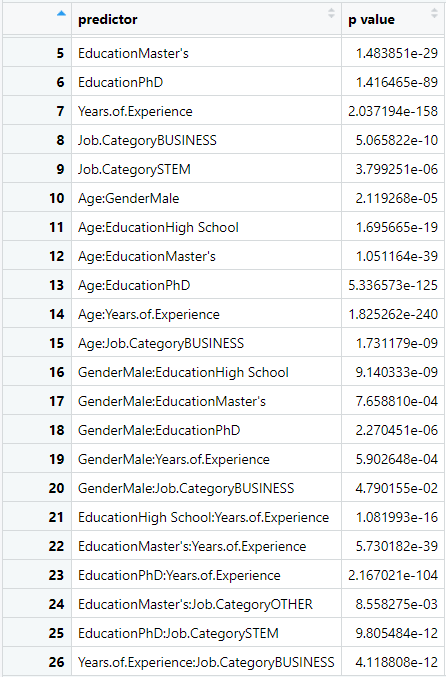

```{r setup, include=FALSE}
knitr::opts_chunk$set(echo = FALSE, fig.width=7, fig.height=4)
library(car)
library(tidyverse)
library(MASS)
library(ggridges)
Salary_Data <- read.csv("Salary_Data.csv")
Salary_Data <- na.omit(Salary_Data)
```

# Authors

Hayden Zhong [henryz3@uw.edu] – First author of Job Title Categorization sections, Revisions

Lorenzo Wahaus [ldw539@uw.edu] – First author of Linearity, collinearity, interactions, and outliers sections

Sophia Chiesa [sc933@uw.edu] – First author of Introduction, Education Level Impact, Conclusion sections

# Introduction

The world of career salaries, especially from the perspective of undergraduate students on the cusp of joining the full-time workforce, choosing a job can be a complex and enigmatic process. This is due to the fact that so many hidden factors seem to impact a job’s salary, and it can be difficult to develop a clear idea of how salaries of differ between jobs. In addition, we are curious how Salaries vary over demographic groups such as Gender and Education Level. Our overall goal is to develop a better understanding of the salary landscape of the current workforce.

The questions our group seeks to answer include, first and primarily, which factors can predict Job Salary. Secondly, as both Age and Years of Experience are included in the data, we want to investigate collinearity of these predictors. Additionally, we want to investigate how big of an effect Education Level has on Salary, especially when considering Years of Experience in a particular job.

# Data Description

The data used for this project is the `Salary_Data` dataset from Kaggle, found [here](https://www.kaggle.com/datasets/mohithsairamreddy/salary-data/data) and in the References section.

The description of the data set does not say where the data is from geographically. However, the data set creator did respond to a comment asking what unit the salary data was in, saying that `Salary` was in Indian Rupees(INR). Given this information, it is most likely that this data set is sampled from India.

There are 6698 complete rows and six columns: `Age` (in Years), `Gender` (`Male`, `Female`, or `Other`), `Education.Level` (`Bachelor’s`, `Master’s`, or `PhD`), `Job.Title`, `Years.of.Experience`, and `Salary` in `INR`. The numeric variables are `Age`, `Years.of.Experience`, and `Salary`, while `Gender`, `Education.Level`, and `Job.Title` are categorical. The `Job.Title` column has a ton of levels; We found that some job titles had hundreds of observation while others only had a few, some as little as one observation. Additionally, there are only 14 datapoints with `Gender` as `Other`, so less generalization can be made about Nonbinary gender identities.

Due to the `Job.Title` column having a large number of levels, we will be grouping job titles together into a new variable `Job.Category` to make analysis on job titles easier. Given the arbitrary nature of this, it could potentially have an impact on the statistical power of our findings of `Job.Category` as a predictor of `Salary`.

# Data Processing

The dataset as sourced from Kaggle is generally clean and ready-to-use. However, some data processing will be needed for the `Job.Title` and `Education.Level` columns.

### Job Title Categorizing

For our analysis of `Salary_Data`, we wanted to do a linear regression of `Salary` based on the type of job someone was employed in. The first instinct would be to use the `Job.Title` column of our dataframe for analysis. The problem with this approach is that there are way too many job titles listed in the data. There are `r length((Salary_Data %>% count(Job.Title))$Job.Title)` different job titles, which would make any categorical regression nigh impossible.

Thus, we decided to categorize `Job.Title` into different categories which correspond to different kinds of jobs. The 5 levels for our new `Job.Category` variable are `STEM, BUSINESS, ADMIN, SERVICE, and OTHER`. 

- `STEM` describes scientific and technical jobs, like computer programming, scientific research, and engineering. 

- `BUSINESS` refers to any jobs involving the financial and marketing aspects of running businesses and companies. 

- `ADMIN` refers to managerial and administrative jobs, involves project management, training, and human resource management. 

- `SERVICE` refers to jobs the involve mainly interacting with customers and helping them in some way

- `OTHER` refers to jobs that don't fit any of the categories listed above

To sort the majority of Job Titles, we did a content analysis of all the words contained in the `Job Title` levels to see which words were recurring. These key words were then coded and sorted into 1 of 5 job categories. We then created functions to check if a Job Title contained a key word from the designated list, and if it contained a keyword was sorted into that Job Category, if the Job Title didn't contain any of the keyword it was sorted into `OTHER` if the Job Title contained keywords from 2 or more categories it was temporarily sorted into the `OVERLAP` category. These jobs with overlap were then manually sorted based on which Job Category fit best.

```{r}
# Job Category Word Lists
# STEM
STEM <- c(" Technology ", " Digital ", " Science ", " Engineer ", " Software ",
          " Network ", " Architect ", " Scientist ", " Engineering ", " Research ",
          " Data ", " Specialist ", " IT ", " Web ", " Developer ",
          " Stack ", " Researcher ", " Techinical ")
# Admin
ADMIN <- c(" Admin ", " Rep ", " Human ", " Recruiter ", " Relations ",
           " Strategy ", " Manager ", " Director ", " Management ", " Coordinator ",
           " Coordinator ", " Office ", " Training ", " Supply ", " VP ",
           " Accountant ", " Resources ", " Principal ", " Executive ", " Administrative ",
           " Officer ", " Entry ", " HR ", " Operations ", " Project ")

# Business
BUSINESS <- c(" Account ", " Business ", " Product ", " Capital ", " UX ", " Advertising ", " Quality ", " Development ", " Marketing ", " Finance ", " Sales ", " Financial ", " Associate ", " Social ", " Intelligence ", " Copywriter ", " Advisor ", " Media ", " Public ")

# Service
SERVICE <- c(" Customer ", " Success ", " Delivery ", " Service ", " Help ", " Support ")

# Function to Test if there is Job Category Overlap for Job Titles
is_STEM <- function(title) {
  title_standard <- paste("", title, "")
  for (word in STEM) {
    if(grepl(word, title_standard)) {
      return(TRUE)
    }
  }
  return(FALSE)
}

is_ADMIN <- function(title) {
  title_standard <- paste("", title, "")
  for (word in ADMIN) {
    if(grepl(word, title_standard)) {
      return(TRUE)
    }
  }
  return(FALSE)
}

is_BUSINESS <- function(title) {
  title_standard <- paste("", title, "")
  for (word in BUSINESS) {
    if(grepl(word, title_standard)) {
      return(TRUE)
    }
  }
  return(FALSE)
}

is_SERVICE <- function(title) {
  title_standard <- paste("", title, "")
  for (word in SERVICE) {
    if(grepl(word, title_standard)) {
      return(TRUE)
    }
  }
  return(FALSE)
}

check_overlap <- function(title) {
  bool_vector <- c()
  bool_vector[1] <- is_STEM(title)
  bool_vector[2] <- is_ADMIN(title)
  bool_vector[3] <- is_BUSINESS(title)
  bool_vector[4] <- is_SERVICE(title)
  if(mean(bool_vector) > 1/4) {
    return(TRUE)
  }
  return(FALSE)
}

# Takes care of overlapping categorizations for job titles
STEM.overlap <- c("Chief Data Officer", "Chief Technology Officer", "Data Entry Clerk", "Director of Data Science", "Director of Engineering", "IT Manager", "IT Support", "IT Support Specialist", "Principal Engineer", "Principal Scientist", "Research Director", "Senior IT Project Manager", "Senior IT Support Specialist", "Senior Project Engineer", "Software Engineer Manager", "Software Manager", "Software Project Manager", "Technical Support Specialist", "UX Researcher")
ADMIN.overlap <- c("Director of Human Capital", "Project Engineer", "Senior HR Specialist", "Senior Human Resources Specialist", "Senior Training Specialist", "Training Specialist")
BUSINESS.overlap <- c("Account Manager", "Business Development Manager", "Content Marketing Manager", "Digital Marketing Manager", "Digital Marketing Specialist", "Director of Business Development", "Director of Finance", "Director of Marketing", "Director of Product Management", "Director of Sales", "Director of Sales and Marketing", "Financial Manager", "Junior Account Manager", "Junior Advertising Coordinator", "Junior Business Operations Analyst", "Junior Marketing Coordinator", "Junior Marketing Manager", "Junior Marketing Specialist", "Junior Product Manager", "Junior Social Media Manager", "Junior Social Media Specialist", "Marketing Coordinator", "Marketing Director", "Marketing Manager", "Marketing Specialist", "Product Manager", "Product Marketing Manager", "Public Relations Manager", "Sales Director", "Sales Executive", "Sales Manager", "Sales Operations Manager", "Senior Account Executive", "Senior Account Manager", "Senior Business Development Manager", "Senior Financial Manager", "Senior Marketing Coordinator", "Senior Marketing Director","Senior Marketing Manager", "Senior Marketing Specialist", "Senior Product Development Manager", "Senior Product Manager", "Senior Product Marketing Manager", "Senior Sales Manager", "Social Media Manager", "Social Media Specialist", "VP of Finance")
SERVICE.overlap <- c("Customer Service Manager", "Customer Service Rep", "Customer Success Manager", "Customer Success Rep", "Junior Customer Support Specialist")
sort.overlap <- function(job_titles) {
  i <- 1
  categories <- c()
  for(title in job_titles) {
    if(title %in% STEM.overlap) {
      categories[i] <- "STEM"
    } else if(title %in% ADMIN.overlap) {
      categories[i] <- "ADMIN"
    } else if(title %in% BUSINESS.overlap) {
      categories[i] <- "BUSINESS"
    } else if(title %in% SERVICE.overlap) {
      categories[i] <- "SERVICE"
    } else {
      categories[i] <- title
    }
    i <- i + 1
  }
  return(categories)
}

job_category <- function(job_titles) {
    i <- 1
    categories <- c()
    for (title in job_titles) {
      if(title %in% STEM.overlap) {
        categories[i] <- "STEM"
      } else if(title %in% ADMIN.overlap) {
        categories[i] <- "ADMIN"
      } else if(title %in% BUSINESS.overlap) {
        categories[i] <- "BUSINESS"
      } else if(title %in% SERVICE.overlap) {
        categories[i] <- "SERVICE"
      } else {
        categories[i] <- case_when(check_overlap(title) ~ "OVERLAP",
                        is_STEM(title) ~ "STEM",
                        is_ADMIN(title) ~ "ADMIN",
                        is_BUSINESS(title) ~ "BUSINESS",
                        is_SERVICE(title) ~ "SERVICE",
                        TRUE ~ "OTHER")
      }
      i <- i + 1
    }
    return(categories)
}
```

```{r}
job_categories <- job_category(Salary_Data$Job.Title)
# job_categories <- sort.overlap(job_categories)
Salary_Data <- Salary_Data %>% mutate(Job.Category = job_categories)
```

The new variable can now be used in our linear regression analysis. One potential issue with the validity of this statistical analysis, is that the job categorizations we designated are somewhat arbitrary particularly in the case that we had overlap between job titles. This could potentially compromise the statistical power of any analysis of the job category variable.

```{r}
# Create linear model for response Salary, and predictors Years.of.Experience, and Job.Category
Job.Salary.fit <- lm(Salary ~ Job.Category + Years.of.Experience, data=Salary_Data)
summary(Job.Salary.fit)$coefficients
```

Looking at the job category linear model `Job.Category` does appear to be a strong predictor of `Salary` with all levels appearing to be statistically significant.

### Education Levels Normalization

We also noticed later on that the `Education.Level` column had categories that should be put together, such as `phD` and `PhD`, and `Bachelor's` and `Bachelor's Degree`, where they denoted the same level of education. So, we fixed that variable to levels: `High School`, `Bachelor's`, `Master's`, and `PhD`.

```{r}
#Ed.LVLs <- unique(Salary_Data$Education.Level)
#Ed.LVLs

High <- c("High School")
Bachelor <- c("Bachelor's", "Bachelor's Degree")
Master <- c("Master's", "Master's Degree")
PhD <- c("PhD", "phD")


education <- function(ed_lvls) {
    i <- 1
    ED <- c()
    n <- length(ed_lvls)
    while (i <= n) {
      if(ed_lvls[i] %in% High){
        ED[i] <- "High School"
      } else if(ed_lvls[i] %in% Bachelor){
        ED[i] <- "Bachelor's"
      } else if(ed_lvls[i] %in% Master) {
        ED[i] <- "Master's"
      } else if(ed_lvls[i] %in% PhD) {
        ED[i] <- "PhD"
      }else {
        ED[i] <- NA
      }
      i <- i + 1
    }
    return(ED)
}
```

```{r}
schooling <- education(Salary_Data$Education.Level)
Salary_Data$Education <- schooling
Salary_Data <- na.omit(Salary_Data)
```

### Removings NAs

Finally, there were only 6 of 6704 observations with `NA` or missing values, two of them being completely empty rows, one missing an value for `Education.Levl`, and the remaining three with `NA` values in the `Salary` and `Years.of.Experience` columns. These 6 observations were omitted from our final data analysis.


# Linearity check

Before doing a linear model, we want to check that the predictors and response variables have a linear relationship. So, as age and experience are our numerical predictors, we will make a scatterplot of each of them compared to salary. Looking at the scaterplots, we see that they both appear to have a mostly linear relationship, so a linear model does make sense in this case. There may be some slight curvature, which we will explore with a square root transformation later on.

```{r}
par(mfrow = c(1, 2))
plot(Salary_Data$Age, Salary_Data$Salary)
plot(Salary_Data$Years.of.Experience, Salary_Data$Salary)
```

# Collinearity of Age and Experience

We want to check if age and years of experience are collinear. It makes logical sense that they would be, as you would not expect a person fresh out of college to have much experience. And a person who is older could have been is a job for years. But, there could be other factors that cause them to not be related, such as changing jobs or fields, and thus being older with less experience.

We will use three methods to check the collinearity of age and experience. The first will be a scatterplot of the two variables. If they are unrelated we will see an even spread, and if they are related, there will be a more linear spread. We will also use two functions in R, to find two numbers that would hint towards collinearity, the correlation coefficient and the variance inflation factor. If the correlation coefficient is greater than 0.8 or the variance inflation factor is greater than 10, there is evidence of collinearity. The third test will be fitting a linear regression to just age and experience, with age as the predictor and experience as the response. If the two are collinear, then there will be statistically significant evidence of a linear relationship between the two variables from a t-test.

```{r}
AgeVsExp <- Salary_Data[,c("Salary", "Age", "Years.of.Experience")]
AgeVsExp$Age <- as.numeric(AgeVsExp$Age)
AgeVsExp$Years.of.Experience <- as.numeric(AgeVsExp$Years.of.Experience)
Age_S <- as.numeric(AgeVsExp$Age)
Experience_S <- as.numeric(AgeVsExp$Years.of.Experience)

plot(Age_S, Experience_S, main = "Scatterplot of Age vs Experience",
     xlab = "Age",
     ylab = "Experience")
```

Looking at the scatterplot of age versus experience, we see that there appears to be a linear relationship between the two.

```{r}
cor(AgeVsExp$Age, AgeVsExp$Years.of.Experience, use = "complete.obs")
```

Using the correlation function in R gives us a correlation value of 0.9377, which is greater than what we said was needed to consider a collinear relationship possible.

```{r}
AVE.lm <- lm(Salary ~ Age + Years.of.Experience, data = AgeVsExp)
vif(AVE.lm)
```
Creating a quick linear model of Salary predicted by Age and Experience, we can find the Variance Inflation Factor of the two predictors. We see that each of them have a VIF of greater than 8. This again shows us that there is a strong case for collinearity between the two factors.


```{r}
AVE.lm2 <- lm(Years.of.Experience ~ Age, data = AgeVsExp)
summary(AVE.lm2)$coefficients
```
Using R to create a linear regression between Age and Years of Experience we see that the t-test gives a very low p-value, less than 0.001. This means that there is strong evidence of a linear relationship between the two variables, matching all of our previous tests. We see that if Age increases by one, years of experience will increase by roughly 0.746. Thus, as we have statistically significant evidence of Age and Years of Experience being collinear, we will not have both of them in our final model.

# Checking for Interactions

To check for interactions, we fit a linear model including all predictors, and all of their interactions. From those, we selected only the interactions that were statistically significant at the 0.05 level of probability. This gives us the following interactions as significant. Education has multiple significant interactions with both age and experience. Education also has multiple significant interactions with job category. And, looking at rows 16 to 19, gender appears to have a significant interaction with education, and years of experience.

{height=50%, width=50%}

```{r eval=FALSE}
#for some reason, the code worked here, but flipped out when knitting

inter <- lm(Salary ~ (Age + Gender + Education + Years.of.Experience + Job.Category)^2, data = Salary_Data)
inter_summary <- summary(inter)

# Get the coefficient matrix
coefs <- inter_summary$coefficients

# Identify the significant variables
vars <- rownames(coefs)[which(coefs[,4] < 0.05)]
#vars

significant <- data.frame(matrix(NA, nrow = 26, ncol = 2))
colnames(significant) <- c("predictor", "p value")
significant$predictor <- vars

r <- 1
for(i in 1:49){
  if(coefs[i,4] < 0.05) {
    significant[r,2] <- coefs[i,4]
    r <- r + 1
  }
}

tail(significant, n = 21)
```


So, to check that these interactions are significant, we will use the AIC and BIC functions. We will start with a fit of salary based on gender, experience, job category and education. I am leaving out age, as we know it to be collinear with experience based on work done above. We will compare this fit to one that also includes the interactions of education with experience, job category, and gender individually; it will also include the interaction between gender and experience. If the AIC and BIC for the fit including interactions is lower, we will conclude that the interactions are significant and should be included in our final model. Looking at our results below, this does hold, so we will add the interactions to our final model.

```{r}
fit_basic <- lm(Salary ~ Gender + Years.of.Experience + Job.Category + Education, data = Salary_Data)
fit_interactions <- lm(Salary ~ Gender + Years.of.Experience + Job.Category + Education + Education:Years.of.Experience + Education:Job.Category + Education:Gender + Gender:Years.of.Experience, data = Salary_Data)

AIC(fit_basic, fit_interactions)
BIC(fit_basic, fit_interactions)
```


# Education Level Impact

The next question was regarding how big of an impact education level has on salary, and also whether the relationship between salary and years of experience is different for different education groups. This question was motivated by the idea that if having a Master’s degree or PhD provides only a slight increase in salary over having a Bachelor’s at the end of a career, then the degree may not be financially worthwhile.

```{r message=F}
# order education levels
Salary_Data$edu_ordered = factor(Salary_Data$Education,
                                 levels=c("High School", "Bachelor's", "Master's", "PhD"))

ggplot(data=Salary_Data) +
  geom_density_ridges(mapping=aes(x=`Salary`,
                                  y=edu_ordered,
                                  fill=edu_ordered),
                      alpha=0.5, show.legend=F) +
  labs(title="Salary distribution for each education level",
       y="Density per education level",
       x="Salary (INR per year)") +
  scale_x_continuous(breaks=c(0, 50000, 100000, 150000, 200000, 250000))

 # Salary_Data %>% group_by(Education) %>%
 #   summarize(med_salary=median(Salary),
 #             stddev = sd(Salary))
```

The above density plot shows clear differences between education groups, particularly between the high school group and all higher education groups. The high school group has a median salary of only 30,000 INR (\$362 USD) per year, compared to median salaries of 80,000 INR (\$966 USD) for Bachelor's, 130,000 INR (\$1570 USD) for Master's, and 170,000 INR (\$2053) for PhD groups. Thus, based on median salary alone there is a clear benefit that comes with each additional level of education. However, as the median salary increases the variation in salary also increases.

Our next step is to examine how salary changes with years of experience relative to education level. As our initial scatterplots showed a curved relationship between years of experience and salary, we have taken a square root transformation of years of experience which is plotted below.

```{r}
Salary_Data <- Salary_Data %>% mutate(sqrt_yoe = sqrt(`Years.of.Experience`))

ggplot(data=Salary_Data) +
  geom_point(mapping=aes(y=`Salary`, x=sqrt_yoe),
             alpha=0.3) +
  facet_wrap(~`edu_ordered`) +
  labs(title="Salary vs. sqrt(years of experience) for each education level",
       x="Square root of years of experience")
```

The scatterplot does not show any clear differences between the linear trends of salary vs. years of experience for each education group. To examine the relationship more closely we constructed a linear model using only square root of years of experience, education level, and their interaction as predictors of salary. 

```{r}
lm.edu_yoe <- lm(Salary ~ Education*sqrt_yoe, data=Salary_Data)
summary(lm.edu_yoe)$coefficients
```

```{r}
slopes <- c(lm.edu_yoe$coefficients[5] + lm.edu_yoe$coefficients[6],
            lm.edu_yoe$coefficients[5],
            lm.edu_yoe$coefficients[5] + lm.edu_yoe$coefficients[7],
            lm.edu_yoe$coefficients[5] + lm.edu_yoe$coefficients[8])
```

In agreement with the analysis of interactions above, the interaction between education level and square root of years of experience is significant at the $\alpha=0.01$ level for all education levels tested. That is, the change in salary for increased years of experience is significantly different for different education levels. In order of high school, Bachelor's, Master's, and PhD groups, after adjusting for the square root transformation the expected increase in salary per one year increase in experience is 22195, 38535, 36065, and 31064 INR. In other words, the benefit of a Bachelor's over a high school diploma is strongest considering both the median salary and increase in salary over years of experience. Due to the higher median salaries of the Master's and PhD groups, there are still benefits to these higher degrees but the increase in salary over time is less.

# Outliers

To find any possible outliers in our data, we will find the Cook's Distance for each of the data points. If any data point has a Cook's distance greater than 0.5, we will look into removing it as it would potentially be an outlier. The model that we will use to calculate this is the interactions fit model, as seen in the Interactions section, as it is our most complete model at this point. Looking at the plot, we see that all but one of the points have a cook's distance of less than 0.05. The 29th data point has a relatively high cook's distance, compared to the others, between 0.08 and 0.10. But, it is less than 0.5, so we do not have enough evidence to consider any points an outlier to be removed.

```{r}
plot(fit_interactions, which = 4)
```


# Final model

Based on all of our previous data, we decided to make our final model based on response variable Salary with predictors `Gender`, `sqrt(Years.of.Experience)`, `Job.Category`, `Education.Level`, and interaction terms of `Education.Level` with the other three predictors, and the interaction term `Gender:sqrt(Years.of.Experience)`. Running the stepwise AIC function, it removed the interaction term `Gender:sqrt(Years.of.Experience)`.

```{r}
final.LM1 <- lm(Salary ~ Gender + sqrt_yoe + Job.Category + Education + Education:sqrt_yoe + Education:Job.Category + Education:Gender + Gender:sqrt_yoe, data = Salary_Data)

#summary(final.LM1)

#step(final.LM1, direction = "both", k=2)

final.LM2 <- lm(Salary ~ Gender + sqrt_yoe + Job.Category + Education + Education:sqrt_yoe + Education:Job.Category + Education:Gender, data = Salary_Data)

options(width=100)
summary(final.LM2)
```

```{r warning=F}
par(mfrow = c(1, 2))
plot(final.LM2, which=1)
plot(final.LM2, which=2)
```

When verifying the assumptions of our model, we found that the residuals are generally centered around 0, but there may be some curvature for the lower and upper ends of the `Salary` variable. Additionally, there is a slight curved pattern in the QQ-plot, suggesting that the errors might not be exactly normally distributed.

# Conclusion

Our final model finds that salary is strongly predicted by many factors, including level of education, job category, education, and some interactions between them. Notably, the interaction of education and square root years of experience was significant, but the interaction between gender and years of experience was not. This suggests that while different genders did have different salaries on average (the male group having a 4906 INR increase over the female group), there is no evidence of different increases in salary with added experience.

We found that age and years of experience are strongly collinear, which suggests that most individuals sampled in the data set stayed in the same industry for most of their career. For job categories, the STEM category had on average the highest salary. This that jobs in tech industries have highest pay. One question we could investigate next is whether job category is correlated with education level, since it is possible that people in STEM jobs are likely to have a higher level of education.

# References

Reddy, M. S. R., Sukumar, J. G., Sambangi, N. (2023). *Salary_Data* [Data File]. Retrieved from https://www.kaggle.com/datasets/mohithsairamreddy/salary-data/data